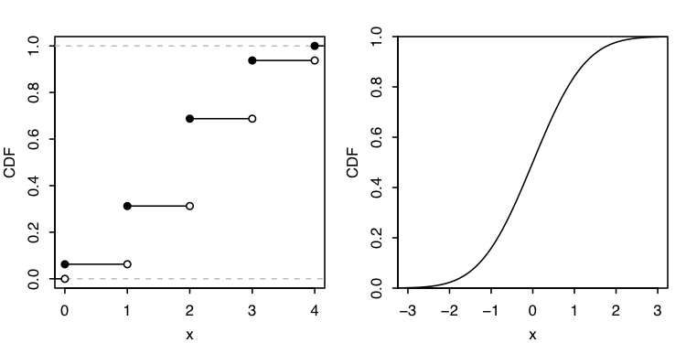
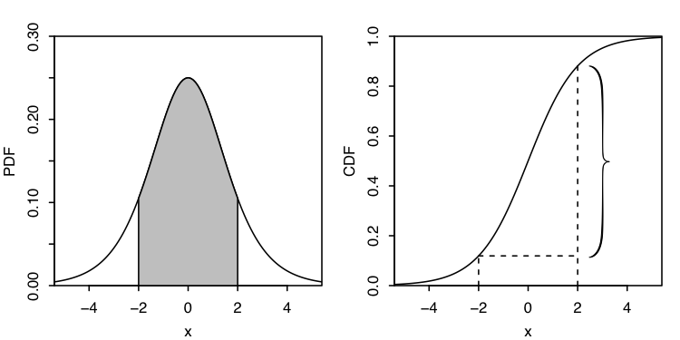

# 4 Continuous Random Variables

Together, discrete and continuous approaches form a powerful framework
for modeling the world.

## 4.1 Probability density function

Continuous RVs!

An RV has a *continuous distribution* if its CDF is differentiable. Endpoints of CDF may be continuous but not differentiable. A continuous RV is a RV with a continuous distribution.

For a continuous RV $X$ with CDF $F$, the PDF of $X$ is derivative $f$ of the CDF: $f(x)=F'(x)$

The support of $X$: all $x$ where $f(x)>0$.

The PDF is kinda similar to PMF, but for PDF quantity of $f(x)$ **is not a probability**. To obtaion the probability, we need to **integrate** PDF.

 We can be carefree about including or excluding endpoints as above for continuous RVs, but we must not be careless about this for discrete RVs.

Valid PDF of a continuous RV:

1. Nonnegative: $f(x) \geq 0$
2. Integrates to 1: $\int^{\infty}_{-\infty}f(x)dx=1$

Example: logistic distribution.

$X \sim$ Logistic.

CDF:

$$
F(x) = \frac{e^x}{1+e^x}, x \in \mathbb{R}
$$

PDF:

$$
F(x) = \frac{e^x}{(1+e^x)^2}, x \in \mathbb{R}
$$

To find $P(-2<X<2)$, we need to integrate PDF from $-2$ to $2$:

$$
P(-2<X<2) = \int^2_{-2}\frac{e^x}{(1+e^x)^2} = F(2)-F(-2) \approx 0.76
$$

Or $P(−2<X<2)$ is indicated by the shaded area under the PDF and the height of the curly brace on the CDF.

## 4.2 Uniform distribution

A continuous RV $U$ has the *Uniform distribution* $X \sim Unif(a, b)$ on the interval $(a, b)$ if its PDF is:

$$
f(x)=\frac{1}{b-a}\ \forall a < x < b,\\
f(x)=0\ otherwise
$$

The CDF is the accumulated area under the PDF:

$$
F(x)=0\ \forall x \leq a,\\
F(x)=\frac{x-a}{b-a}\ a < x < b,\\
F(x)=1\ \forall x \geq b.\\
$$

$Unif(0,1)$ is the standard Uniform.

For Uniform distributions, *probability is proportional to length.*

Location-scale transformation.

The RV $Y$ has been obtained as a *location-scale transformation* of $X$ if $Y=\sigma X + \mu$. $\mu$ controls the location and $\sigma$ controls the scale.

**Warning**: if $Y$ is a linear function of $X$, the Uniformity is preserved, but if $Y$ is defined as a *nonlinear* transformation of $X$, $Y$ will not be Uniform.

**Warning**: When using location-scale transformations, the shifting and scaling should be applied to the *random variables* themselves, not to their PDFs.

## 4.3 Universality of the Uniform

Given a $Unif(0,1)$ RV, we can construct an RV with *any continuous distribution we want.*
