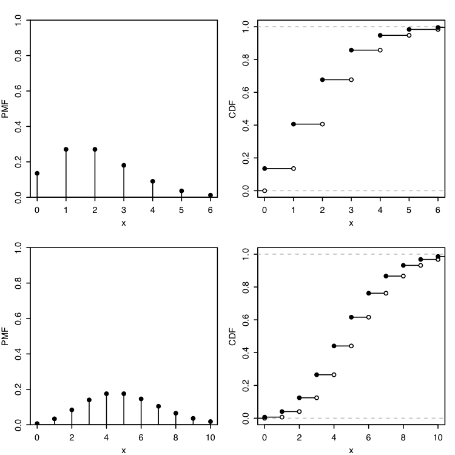

# 5 Averages, Law of Large Numbers, and Central Limit Theorem

Expectation, standard deviation and correlation.

Expectation is the most widely used notion of average in statistics, because of its intuitive interpretations and convenient properties.

Linearity is the most important property of expectation.

The law of large numbers (LLN) and central limit theorem (CLT) are powerful results about the sample mean of a large number of IID RVs.

The LLN says that the sample mean is likely to be close to the theoretical expectation. The CLT says that the sample mean will be approximately Normal.

## 5.1 Expectation

Arithmetic mean of $x_1,x_2,...,x_n$:

$$
\overline{x} = \frac{1}{n} \sum^n_{j=1}x_j.
$$

More generally, weighted mean of $x_1,x_2,...,x_n$:

$$
weighted\_mean(x) = \sum^n_{j=1}x_j p_j.
$$

Where the weights $p_1,p_2,...,p_n$ are pre-specified nonnegative numbers with $\sum_{j=1}^n p_i = 1$ (so for unweighted mean $p_j=1/n\ \forall\ i$).

The definition of *expectation of DRV* is inspired by weighted mean, weights are probabilities:

The **expected value** (or **expected mean)** of DRV $X$ whose possible values are $x_1,x_2,...$ is:

$$
E(X)=\sum^{\infty}_{j=1} x_j P(X=x_j).
$$

If support is finite,

$$
E(X) = \sum_x x P(X=x)
$$

Where $x$ is value and $P(X=x)$ is PMF at $x$.

The expectation is undefined if $\sum_{j=1}^{\infty}|x_j|P(X=x_j)$ diverges, since then the series for $E(X)$ diverges or depends on the order in which the $x_j$ are listed.

**Warning!**

For any DRV $X$, $E(X)$ is a number (if exists). Common mistake: to replace an RV by its expectation which is wrong because $X$ is a function, $E(X)$ is a constant, and ignores the variability of $X$.

*Notation*:

$E(X)$ is abbreviating to $EX$, similarly $EX^2$ is $E(X^2)$ not $(E(X))^2$ !

The order of operations here is very important!

## 5.2 Linearity of expectation

The most important property of expectation is *linearity*: expected sum of RVs is the sum of expectations: $\forall X, Y$ $\forall$ constant $c$:

$$
E(X+Y)=E(X)+E(Y),\\
E(cX)=cE(X).
$$

Averages can be calculated in two ways, *ungrouped* or *grouped*, is all that is needed to prove linearity!

It allows us to work with the distribution $X$ directly without returning to the sample space.

But we can't use the same super-pebbles for another RV $Y$ on the same sample space.

We can take a weighted average of the values of individual pebbles. If $X(s)$ is the value assigns to pebble $s$:

$$
E(X)=\sum_s X(s)P(\{s\}),
$$

where $P({s})$ is the weight of pebble $s$. This corresponds to the ungrouped way of taking averages! It breaks down the sample space into the smallest possible units, so we are now using the *same* weights $P(\{s\})$ for every random variable:

$$
E(Y)=\sum_s Y(s)P(\{s\}).
$$

Now we can combine $E(X)$ and $E(Y)$:

$$
E(X) + E(Y)=\sum_s X(s)P(\{s\}) + \sum_s Y(s)P(\{s\})=\\\sum_s (X+Y)(s)P(\{s\}) = E(X+Y)
$$

Using this property, we can calculate expectations for *Binomial* and *Hypergeometric* distributions!

**Binomial expectation**: for $X \sim Bin(n,p)$:

$$
E(X) = \sum^n_{k=0}kP(X=k) = \sum^n_{k=0}k \binom{n}{k}p^k q^{n-k}.
$$

Linearity of expectation provides a much shorter path to the same result: RV $X$ is the sum of $n$ independent $Bern(p)$ RVs:

$$
X=I_1 + ... + I_n,
$$

each $I_j$ has $E(I_j)=1p + 0q=p$. By linearity,

$$
E(X) = E(I_1)+...E(I_n)=np.
$$

**Hypergeometric expectation**: for $X \sim HGeom(w,b,n)$:

We can write $X$ as a sum of Bernoulli RVs,

$$
X=I_1 + ... + I_n,
$$

Where $I_j$ equals $1$ if jth ball is white and $0$ otherwise. By symmetry, $I_j \sim Bern(p)$, where $p=w/(w+b)$.

These $I_j$ aren't independent, since balls aren't replacing. However, linearity still holds for dependent RVs. Thus,

$$
E(X)=nw/(w+b).
$$

## 5.3 Geometric and Negative Binomial

**Geometric distribution**:

A sequence of independent Bernoulli trials, each with the same success probability $p\in(0,1)$, with trials performed until a success occurs. RV $X$ is the number of failures before the first successful trial. $X$ has the Geometric distribution with parameter $p$: $X\sim Geom(p)$.

Geometric PDF: If $X\sim Geom(p)$, then PMF of $X$ is:

$$
P(X=k)=q^k p
$$

for $k=0,1,2,...$ where $q=1-p$.

This is a valid PMF because

$$
\sum^{\infty}_{k=0}q^k p = p\sum^{\infty}_{k=0}q^k= p\frac{1}{1-q}=1.
$$

**Warning:** In our convention, the *Geometric* distribution **excludes** the success, and the *First Success* distribution **includes** the success $Y\sim FS(p)$.

If $Y \sim FS(p)$, then $Y-1\sim Geom(p)$

**Geometric expectation**:

By definition,
$$
E(X)=\sum^{\infty}_{k=0}kq^k p,
$$

where $q=1-p$. Each term looks similar to $kq^{k-1}$.

$$
\sum^{\infty}_{k=0}q^k = \frac{1}{1-q}.
$$

This series converges because $0<q<1$. Differentiating both sides,

$$
\sum^{\infty}_{k=0}k q^{k-1} = \frac{1}{(1-q)^2}.
$$

Multiply both sides by $pq$:

$$
E(X)=\sum_{k=0}^{\infty}kq^k p=pq\sum_{k=0}^{\infty}kq^{k-1}=pq\frac{1}{(1-q)^2}=\frac{q}{p}
$$

First Success expectation:

$$
E(Y)=E(X+1)=\frac{q}{p}+1=\frac{1}{p}.
$$

**Negative Binomial distribution**

Sequence of independent Bernoulli trials which success probability $p$, $X$ is the number of failures before the $r$th success, $X \sim NBin$.

*Binomial* counts the number of *successes* in a fixed number of *trials*, while the *Negative Binomial* counts the number of *failures* until a fixed number of *successes*.

Negative Binomial PDF: If $X\sim NBin(r,p)$, then PMF of $X$ is:

$$
P(X=n)=\binom{n+r-1}{r-1}p^r q^n
$$

for $n=0,1,2,...$ where $q=1-p$.

Theorem:

If $X\sim NBin(r,p)$, We can write $X=X_1+...X_r$ were $X_i$ are IIDs $\sim Geom(p)$.

**Negative Binomial expectation**:

By previous theorem and linearity,

$$
E(X)=E(X_1)+...+E(X_r)=\frac{rq}{p}.
$$

## 5.4 Indicator RVs and the fundamental bridge

Indicator RVs (look at 3.3) are extremely useful tool for calculating expected values.

*Indicator RV properties*: $A$ and $B$ are events.

1. $(I_A)^k=I_A\ \forall\ k>0$.
2. $I_{A^C}=1-I_A$.
3. $I_{A\cap B}=I_A I_B$.
4. $I_{A\cup B}=I_A + I_B - I_A I_B$.

Proofs:

Property 3: $I_A I_B$ if both $I_A$ and $I_B$ are 1, 0 otherwise. Property 4: $I_{A\cup B}=1-I_{A^C\cap B^C}=1-I_{A^C}I_{B^C}=1-(1-I_A)(1-I_B)=I_A + I_B - I_A I_B$

**Fundamental bridge:**

The probability of an event $A$ is the expected value of its indicator RV $I_A$:

$$
P(A)=E(I_A).
$$

Fundamental bridge allows to express *any* probability as an expectation. We can express a DRV as a sum of a sum of indicator RVs. Using fundamental bridge, we can find the expectation of indicators and find the expectation of original RV!

## 5.5 Law of the unconscious statistician (LOTUS)

$E(g(X))$ doesn't equal $g(E(X))$ if $g$ isn't linear. How to correctly calculate $E(g(X))$?

**LOTUS:**

If $X$ is a DRV and $g$ is a function $\mathbb{R} \rightarrow \mathbb{R}$, then:

$$
E(g(X))=\sum_x g(x)P(X=x),
$$

the sum takes over all possible values of $X$.

So we need only to know PMF of $X$, not PMF of $g(X)$.

Let $X$ have support $0,1,2...$ with probabilities $p_0,p_1,p_2,...$, so the PMF is $P(X=n)=p_n$, then $X^3$ as support $0^3, 1^3, 2^3, ...$ so:

$$
E(X)=\sum^{\infty}_{n=0}np_n,
$$

$$
E(X^3)=\sum^{\infty}_{n=0}n^3p_n.
$$

## 5.6 Variance

Important application of LOTUS is finding the *variance* of an RV.
It tells how spread out the distribution is.

**Variance** of an RV $X$:

$$
Var(X)=E(X-EX)^2.
$$

The square root of the variance is called the **standard deviation**:

$$
SD(X)=\sqrt{Var(X)}
$$

Important: when we write $E(X-EX)^2$ it is the expectation of an RV $(X-EX)^2$, **not** $(E(X-EX))^2$ which is $0$ by linearity.

Why squaring? because $E(X-EX)=0$ because positive and negative deviations cancel each other. However, variation is in squared units so we need SD to receive number in correct units.

Equivalent expression for variance is $Var(X)=E(X^2)-(EX)^2$.
This expression is easier to work with sometimes.

Variance properties:

1. $Var(X+c)=Var(X)\ \forall\ const\ c$
2. $Var(cX)=c^2Var(X)\ \forall\ const\ c$
3. If RVs $X$ and $Y$ are independent, $Var(X+Y)=Var(X)+Var(Y)$. Not true in general if general if RVs are dependent.
4. $Var(X)\ge 0$ and $0$ if and only if $P(X=c)=1$.

*Geometric and Negative Binomial variance:*

If $X \sim Geom(p)$, we already know that $E(X)=q/p$.

$$
Var(X)=E(X^2)-(EX)^2=\frac{q}{p^2}
$$

This is also the variance of First Success distribution.
If an RV $X\sim NBin(r,p)$, it can be represened as a sum of $r$ IIDs $Geom(p)$ so its variance is:

$$
Var(X)=r\frac{q}{p^2}
$$

*Binomial variance:*

If $X \sim Bin(n,p)$, it can be represened as sum of indicator RVs: $X=I_1+I_2+...I_n$ where $I_j$ is indicator for $j-th$ trial. Variance of each $I_j$:

$$
Var(I_j)=E(I^2_j)-(E(I_j))^2=p-p^2=p(1-p).
$$

Since the $I_j$ are independent,  

$$
Var(X)=Var(I_1)+...+Var(I_n)=np(1-p).
$$

## 5.7 Poisson

Poisson distribution is an extremely popular distribution for modeling discrete data.

**Poisson distribution:**

An RV $X$ has the *Poisson distribution* with parameter $\lambda$ where $\lambda > 0$ if its PMF is:

$$
P(X=k)=\frac{e^{-\lambda} \lambda^k}{k!}, k=0,1,2,...
$$

$X \sim Pois(\lambda)$.

**Poisson expectation and variance:**

Let $X \sim Pois(\lambda)$. Then the mean and variance are both equal to $\lambda$.

$$
E(X)=e^{-\lambda} \sum^{\infty}_{k=0}k\frac{\lambda^k}{k!}=
e^{-\lambda} \sum^{\infty}_{k=1}k\frac{\lambda^k}{k!}=\\
=\lambda e^{-\lambda} \sum^{\infty}_{k=1}k\frac{\lambda^{k-1}}{(k-1)!}=
\lambda e^{-\lambda} e^{\lambda}=\lambda
$$

We dropped $k=0$ because it was $0$, then took out $\lambda$ out of sum, so inside remained a Taylor series for $e^{\lambda}$.

To get the variance, let's find $E(X^2)$. By LOTUS,

$$
E(X^2)=\sum^{\infty}_{k=0} k^2 P(X=k) =
e^{-\lambda} \sum^{\infty}_{k=0} k^2 \frac{\lambda^k}{k!}.
$$

Using the same method we used for $Geom$,

$$
E(X^2)=\lambda(1+\lambda).
$$

So the variance is:

$$
Var(X)=E(X^2)-(EX)^2=\lambda(1+\lambda) - \lambda^2=\lambda.
$$

Look at these PMF and CDF for $Pois(2)$ and $Pois(5)$! PMF of $Pois(2)$ is highly skewed, and with big $\lambda$s PMF becomes well-shapred.

Parameter $\lambda$ is interpreted as the rate of occurrence of these rare events!

**Poisson approximation:**

Let $A_1,A_2,...,A_n$ be events $p_j=P(A_j)$ where $n$ is large, the $p_j$ are small, and $A_j$ are independent. Let

$$
X=\sum^n_{j=1}I(A_j)
$$

count how many of the $A_j$ occur. Then $X$ is approximately $Pois(\lambda)$ with $\lambda=\sum^n_{j=1}p_j$.

The Poisson paradigm is also called the *law of rare events*.
(It means that $p_j$ are small).

The Poisson distribution often gives *good approximations*. The Poisson is a popular model, or at least a starting point, for data whose values are nonnegative integers (called *count data* in statistics).

**Sum of independent Poissons:**

If $X \sim Pois(\lambda_1),Y \sim Pois(\lambda_2),$ and $X$ is independent of $Y$, then $X + Y \sim Pois(\lambda_1+\lambda_2).$

## 5.8 Expectation of a continuous RV

**Expectation of a continuous RV:**

The *expected value* or *expectation* or *mean* of a continuous RV $X$ with PDF $f$ is:

$$
E(X)=\int^{\infty}_{-\infty}xf(x)dx.
$$

As in the discrete case, this expectation may not exist.

Linearity of expectation and LOTUS also holds for continuous RV:

If $X$ is a CRV with PDF $f$ and $g$ is a function $\mathbb{R} \rightarrow \mathbb{R}$,

$$
E(g(X))=\int^{\infty}_{-\infty}g(x)f(x)dx.
$$

**Mean and Var of Uniform RVs:**

Let $X \sim Unif(a,b)$ So the expectation is pretty simple to find:

$$
E(U)=\int^b_a x \frac{1}{b-a}dx=\frac{1}{b-a}(\frac{b^2}{2} - \frac{a^2}{2})=\frac{a+b}{2}
$$

For the variance:

$$
E(U^2)=\int^b_a x^2 \frac{1}{b-a}dx=\frac{1}{3}\frac{b^3-a^3}{b-a}
$$

So the variance is:

$$
Var(U)=E(U^2)-(EU)^2 = \frac{1}{3}\frac{b^3-a^3}{b-a} - (\frac{a+b}{2})^2=\frac{(b-a)^2}{12}
$$

**Mean and Var of Normal RVs:**

Let $X \sim \mathcal{N}(\mu,\sigma^2)$. This RV has $E(X)=\mu$ and $Var(X)=\sigma^2$.

**Mean and variance of Exponential RVs:**

Let's start with $X\sim Expo(1)$:

$$
E(X)=\int^{\infty}_{0}xe^{-x}dx=1.
$$

and by LOTUS,

$$
E(X^2)=\int^{\infty}_{0}x^2 xe^{-x}dx=2.
$$

So the variance is:

$$
Var(X) = E(X^2)-(EX)^2 = 1.
$$

Now $Y=X/\lambda ~\sim Expo(\lambda)$. Then,

$$
E(Y)=\frac{1}{\lambda}E(X)=\frac{1}{\lambda},
\\
Var(Y)=\frac{1}{\lambda^2}E(X)=\frac{1}{\lambda^2}.
$$

## 5.9 Law of Large Numbers
