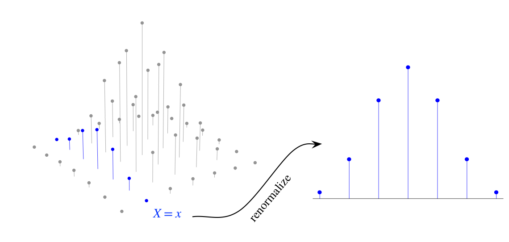

# 6 Joint Distributions and Conditional Expectation

With data coming from several groups, we should consider both *within* group variation and *between* group variation.

Using *conditional expectation*, we can predict the value of one random variable, given the information we have about other random variables.

## 6.1 Joint, marginal, and conditional distributions

We introduce multivariate analogs of the CDF, PMF, and PDF.

Key concepts:

* **Distribution** of RV $X$ provides complete information about the probability of $X$ into any subset of real line.
* **Joint distribution** of two RVs $X$ and $Y$ and provides complete information about the probability of the vector $(X,Y)$.
* **Marginal distribution** of $X$ is the individual distribution of $X$ ignoring the value of $Y$.
* **Conditional distribution** of $X$ given $Y=y$ is the updated distribution of $X$ after observing $Y=y$.

### Discrete joint CDF, PMF:

The **joint CDF** of RVs $X$ and $Y$ is the function $F_{XY}$ given by:

$$
F_{XY}(x,y)=P(X\leq x,Y\leq y)
$$

analogously for joint CDF of $n$ RVs.

The **joint PMF** of discrete RVs $X$ and $Y$ is the function $p_{XY}$, given by:

$$
p_{XY}(x,y)=P(X = x,Y = y)
$$

analogously for joint PMF of $n$ RVs.

We require valid joint PMF to be nonnegative and sum to $1$:

$$
\sum_x \sum_y P(X=x, Y=y)=1.
$$

**Marginal PMF:**
For discrete RVs $X$ and $Y$, the *marginal PMF* of $X$ is:

$$
P(X=x)=\sum_y P(X=x, Y=y)
$$

The operation of summering over the possible values of $Y$ in order to convert the joint PMF to marginal PMF is *marginalizing* out of $Y$.

Now: we observe the value of $X$ and want to update the distribution of $Y$ using this information. Using the marginal PMF isn't good idea because it doesn't take into account any info about $X$. Instead,

**Conditional PMF:**

$$
P(Y=y|X=x)= \frac{P(X=x, Y=y)}{P(X=x)}.
$$

Where $x$ is the observed value of $X$.
The conditional PMF $P(Y=y|X=x)$ is obtained by renormalizing the column of the joint PMF that is compatible with the event $X=x$.

We can also obtain the conditional distribution using Bayes' rule:

$$
P(Y=y|X=x)=\frac{P(X=x|Y=y)P(Y=y)}{P(X=x)}.
$$

Using LOTP, we have another way to get the marginal PMF:

$$
P(X=x)=\sum_y P(X=x|Y=y)P(Y=y)
$$

Now we can revisit the definition of **independence**:

RVs $X$ and $Y$ are *independent* if $\forall x, y$,

$$
F_{X,Y}(x,y)=F_X(x)F_Y(y).
$$

If $X$ and $Y$ are discrete, it is equivalent to:

$$
P(X=x,Y=y)=P(X=x)P(Y=y)
$$

$\forall x, y$ and it is also equivalent to:

$$
P(Y=y|X=x)=P(Y=y)
$$

$\forall y$ and $\forall x$ such that $P(X=x)>0$.
